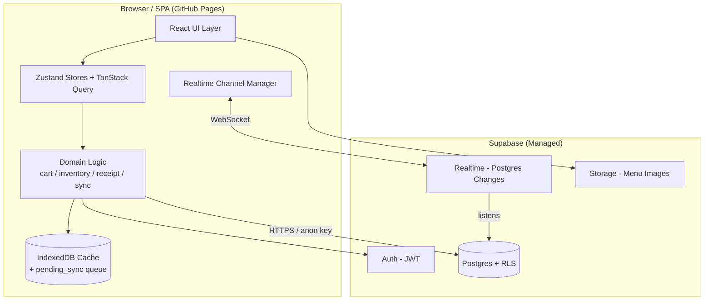
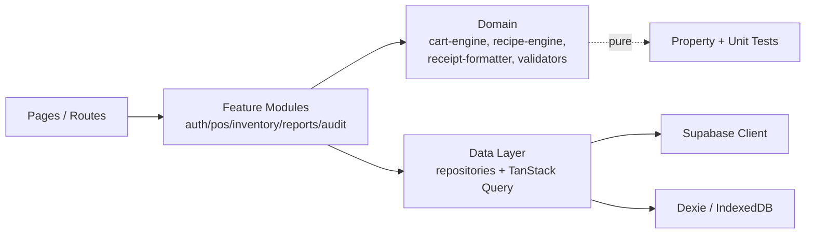
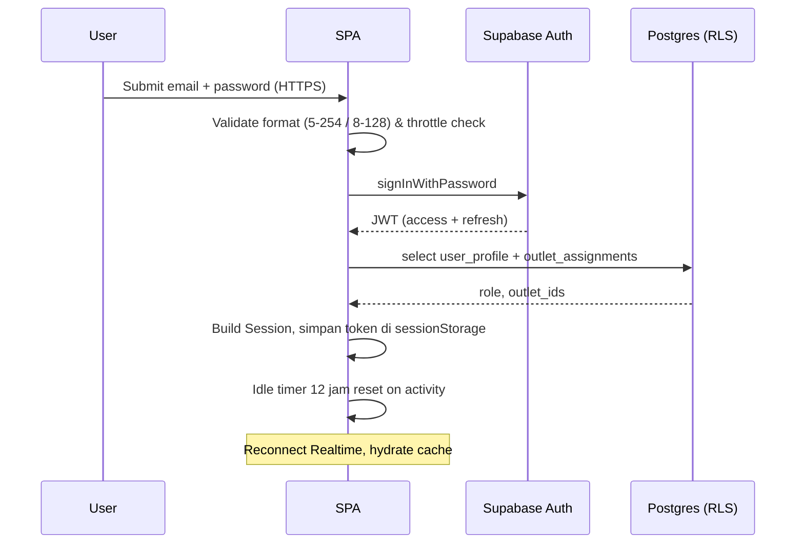
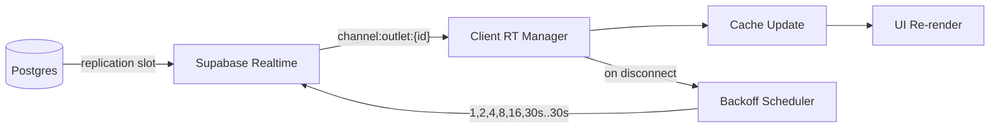
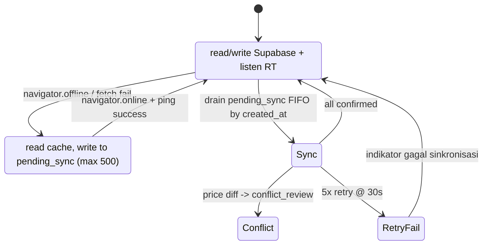
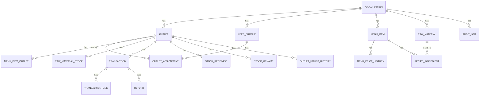

# Design Document

## Overview

Yuzztea POS SaaS adalah Single Page Application (SPA) berbasis **React 18 + Vite + TypeScript** yang di-deploy sebagai static site ke **GitHub Pages**, dengan **Supabase** sebagai backend (Postgres + Auth + Realtime + Storage). Karena tidak ada server kustom, seluruh logic bisnis berjalan di klien dan keamanan multi-tenant dijamin oleh **Row Level Security (RLS)** di Postgres.

Aplikasi melayani satu Organization (Yuzztea) dengan minimal 4 Outlet (skalabel hingga 50) dan tiga peran: **Owner**, **Outlet_Manager**, **Cashier**. Aplikasi dibagi menjadi dua sub-experience:

- **POS_Module** (Cashier-first, mobile/tablet) - mencatat Transaction, mencetak Receipt, mendukung mode offline.
- **Management_Console** (Owner / Outlet_Manager, tablet/desktop) - mengelola Outlet, Menu_Item, Raw_Material, pengguna, laporan, dan audit log.

Identitas visual menggunakan **Glassmorphism** dengan palet hangat khas teh dan yuzu (lemon Asia), dipilih untuk menyampaikan kesan premium dan ringan tanpa mengorbankan keterbacaan operasional kasir.

### Design Goals

| Goal | Strategi |
|------|----------|
| Operasional kasir cepat (<200ms per interaksi keranjang) | Komputasi cart sepenuhnya client-side, mutasi batched, virtualized menu list |
| Tahan jaringan tidak stabil | IndexedDB cache + pending_sync queue maksimum 500 transaksi per perangkat |
| Isolasi data per Outlet | RLS pada seluruh tabel multi-tenant; klien hanya menerima `anon key` |
| Realtime tanpa server tambahan | Supabase Realtime channels per outlet dengan reconnect backoff |
| Konsisten di 360px-1920px | Layout tiga-tier (mobile/tablet/desktop) + glassmorphism dengan fallback solid |
| Auditable | Audit log immutable insert-only di Postgres, hanya Owner yang dapat membaca |

### Non-Goals (Fase Awal)

- Tidak ada custom backend / Edge Function pada fase awal (semua via PostgREST + RLS).
- Tidak ada integrasi gateway pembayaran online (QRIS/transfer adalah pencatatan manual).
- Tidak ada multi-organization (hanya tenant Yuzztea).
- Tidak ada inventory di tingkat organization (semua stok per Outlet).

---

## Architecture

### High-Level Architecture



### Deployment

- **Hosting**: GitHub Pages serves built artifacts from `dist/` (Vite build).
- **Routing**: Hash-based routing (`HashRouter`) untuk kompatibilitas GitHub Pages tanpa server-side rewrite.
- **Environment**: hanya `VITE_SUPABASE_URL` dan `VITE_SUPABASE_ANON_KEY` di-bundle. `service_role` key tidak pernah masuk repo.
- **Build pipeline**: GitHub Actions menjalankan lint, type-check, unit/property test, lalu `vite build` dan deploy.

### Layered Logical Architecture



- **Domain layer** berisi pure functions (cart calculation, recipe deduction, receipt formatter, validators). Inilah area utama property-based testing.
- **Data layer** mengabstraksi Supabase + IndexedDB di balik Repository interface, sehingga domain tidak tergantung transport.
- **Feature modules** adalah orchestration: hooks, mutations, side effects, dan UI binding.

### Authentication & Session Flow



### RLS / Authorization Model

Setiap tabel multi-tenant memiliki kolom `organization_id` (selalu sama, ID Yuzztea) dan, jika relevan, `outlet_id`. RLS policy:

- **Owner**: `organization_id = current_org()` -> akses semua outlet.
- **Outlet_Manager / Cashier**: `outlet_id IN (select outlet_id from outlet_assignments where user_id = auth.uid() and active = true)`.
- **Audit log**: select hanya untuk Owner; insert hanya via SECURITY DEFINER function yang dipanggil dari trigger atau klien dengan parameter terkontrol; update/delete diblokir untuk semua role.
- **Menu_Item dengan outlet override**: tabel `menu_item_outlet` (overlay per outlet) untuk harga/status_aktif spesifik outlet.

Akses lintas-outlet oleh klien dijawab dengan baris kosong (RLS) dan dicatat di `access_audit_log` melalui trigger pada query yang berhasil filter (logging "intent" via dedicated RPC `log_unauthorized_outlet_attempt`).

### Realtime Sync Strategy



- Klien subscribe channel per outlet yang diizinkan untuk Session aktif.
- Payload divalidasi dengan **Zod** sebelum di-merge ke cache; payload invalid di-log dan diabaikan (Req 10.7).
- Setelah 10 percobaan gagal, status `disconnected_terminal` ditampilkan dan tombol "Coba Lagi" muncul (Req 10.5).

### Offline-Resilience Strategy



- Cache utama (Menu_Item, Outlet, Recipe, RawMaterial-snapshot) di IndexedDB melalui **Dexie**.
- Pending transactions disimpan dengan status `pending_sync`, di-replay berurutan menurut `created_at`.
- Konflik harga: simpan harga saat transaksi dibuat, tandai `conflict_review` (Req 11.5).

### Stack Decisions

| Concern | Pilihan | Alasan |
|---------|---------|--------|
| UI framework | React 18 + TypeScript | Ekosistem kaya, mendukung Suspense, sesuai SPA |
| Build | Vite | Cepat, sederhana untuk SPA |
| Styling | Tailwind CSS + CSS variables | Konsisten dengan steering guide; mendukung glassmorphism |
| Component library | shadcn/ui (selektif) | Aksesibel, headless, mudah dikustomisasi glass |
| Routing | React Router (HashRouter) | Kompatibel GitHub Pages |
| Server state | TanStack Query v5 | Cache, retry, stale-while-revalidate |
| Client state | Zustand | Ringan; cocok untuk cart, session, UI state |
| Forms + validation | React Hook Form + Zod | Validasi shared dengan domain |
| Offline cache | Dexie (IndexedDB) | Storage besar, transaksional, query-able |
| Charts | Recharts (Line, Bar, Pie) | Lib React-friendly, ringan, sufficient untuk Req 9 |
| Date | date-fns + date-fns-tz | Asia/Jakarta formatting deterministik |
| Realtime | @supabase/supabase-js v2 | Wrapper resmi Realtime |
| Testing | Vitest + fast-check + Testing Library + Playwright | Unit, property, E2E |

---

## Components and Interfaces

Komponen dipisah berdasarkan layer: **Domain** (pure), **Data** (repository), **Feature** (hook + UI), **Cross-cutting** (Auth, Realtime, Cache).

### Domain Components (Pure, Testable)

#### CartEngine

Menghitung subtotal, diskon, pajak, total, dan kembalian; immutable.

```ts
type CartLine = { menuItemId: string; name: string; unitPrice: number; qty: number };
type Discount = { kind: "amount" | "percent"; value: number };
type TaxRule = { enabled: boolean; ratePercent: number };

interface CartTotals {
  subtotal: number; discount: number; tax: number; total: number;
  changeDue: (amountPaid: number) => number;
}

function computeTotals(lines: CartLine[], discount: Discount | null, tax: TaxRule): CartTotals;
function addLine(lines: CartLine[], item: Omit<CartLine, "qty">): CartLine[]; // qty++ if exists
function setQty(lines: CartLine[], menuItemId: string, qty: number): CartLine[]; // qty 0 -> remove
function clamp(n: number, min: number, max: number): number;
```

Constraints: `lines.length <= 100` (Req 7.2), unit price = integer Rupiah, qty integer >= 1.

#### RecipeEngine

Menentukan kebutuhan Raw_Material dan menghasilkan delta stok.

```ts
type Recipe = { menuItemId: string; ingredients: { rawMaterialId: string; qtyPerUnit: number }[] };
type StockSnapshot = Record<string /* rawMaterialId */, number>;
type StockShortfall = { rawMaterialId: string; required: number; available: number; shortBy: number };

function requiredMaterials(recipes: Recipe[], lines: CartLine[]): Record<string, number>;
function checkAvailability(req: Record<string, number>, stock: StockSnapshot): StockShortfall[];
function applyDeduction(stock: StockSnapshot, req: Record<string, number>): StockSnapshot; // dapat negatif
function applyRefund(stock: StockSnapshot, req: Record<string, number>): StockSnapshot;
```

#### ReceiptFormatter

Menghasilkan teks Receipt deterministik untuk thermal 58mm dan 80mm.

```ts
type ReceiptInput = {
  outlet: { name: string; address: string };
  txId: string; createdAt: Date; cashierName: string;
  lines: { name: string; qty: number; unitPrice: number; subtotal: number }[];
  subtotal: number; discount: number; tax: number; total: number;
  paymentMethod: "tunai" | "qris" | "transfer";
  amountPaid: number; change: number;
  reprint?: { at: Date };
};

function formatReceipt(input: ReceiptInput, width: 58 | 80): string;
function formatRupiah(n: number): string; // "Rp 12.500", locale id-ID, no decimal
function formatJakartaTime(d: Date): string; // DD/MM/YYYY HH:mm:ss WIB
```

Width 58mm = 32 cols, 80mm = 48 cols (monospace). Wrapping deterministik via word-aware line break.

#### Validators (Zod schemas, dipakai server & client)

```ts
const Email = z.string().min(5).max(254).regex(/.+@.+\..+/);
const Password = z.string().min(8).max(128);
const OutletCode = z.string().min(3).max(20).regex(/^[A-Za-z0-9]+$/);
const HHMM = z.string().regex(/^([01]\d|2[0-3]):[0-5]\d$/);
const MenuItemSchema = z.object({ name: z.string().min(1).max(100), category: z.string().min(1).max(50), basePrice: z.number().int().min(0).max(10_000_000), description: z.string().max(500).optional(), imageBytes: z.number().max(2 * 1024 * 1024).optional() });
const QtyTwoDp = z.number().min(0).max(999_999.99); // 2 desimal
const Whatsapp = z.string().regex(/^\d{10,15}$/);
```

#### SyncEngine (offline)

```ts
type PendingTx = { id: string; createdAt: string /* ISO */; payload: TransactionDraft; retryCount: number };
function enqueue(queue: PendingTx[], tx: PendingTx): PendingTx[]; // reject jika length >= 500
function nextBatch(queue: PendingTx[]): PendingTx[]; // sort by createdAt asc
function shouldRetry(tx: PendingTx): boolean; // retryCount < 5
```

#### AuthThrottle

```ts
type ThrottleState = { failures: { ts: number }[]; nextAllowedAt: number };
function recordFailure(s: ThrottleState, now: number): ThrottleState; // backoff 1s,2s,4s,...,max 300s setelah 5 kegagalan dalam 10 menit
function canAttempt(s: ThrottleState, now: number): { ok: boolean; waitMs: number };
```

### Data / Repository Layer

Setiap repository di-define sebagai TypeScript interface, diimplementasi dengan Supabase. Contoh:

```ts
interface OutletRepository {
  list(opts?: { activeOnly?: boolean }): Promise<Outlet[]>;
  create(input: OutletDraft): Promise<Outlet>;
  update(id: string, patch: Partial<OutletDraft>): Promise<Outlet>;
  setActive(id: string, active: boolean): Promise<void>;
}

interface TransactionRepository {
  create(draft: TransactionDraft): Promise<Transaction>;
  refund(txId: string, by: UserId): Promise<Transaction>;
  list(filter: TxFilter): Promise<Transaction[]>;
}

interface InventoryRepository {
  getStock(outletId: string): Promise<StockSnapshot>;
  recordReceiving(input: ReceivingDraft): Promise<void>;
  recordOpname(input: OpnameDraft): Promise<void>;
}
```

Mutasi sensitif (transaksi + pengurangan stok, refund + pengembalian stok) dipanggil melalui **Postgres Function** (`SECURITY DEFINER`) sehingga atomicity dijamin di server (Req 7.7, 7.10, 6.4).

### Feature Modules (UI + Hooks)

| Module | Hooks utama | UI Pages |
|--------|-------------|----------|
| `auth` | `useSession`, `useLogin`, `useLogout`, `useThrottle` | /login, /no-outlet |
| `pos` | `useCart`, `useMenuCatalog`, `useCheckout`, `useReceipt`, `useOfflineQueue` | /pos, /pos/checkout |
| `outlets` | `useOutlets`, `useOutletForm` | /admin/outlets |
| `users` | `useUsers`, `useAssignments` | /admin/users |
| `menu` | `useMenuItems`, `useMenuForm`, `usePriceHistory` | /admin/menu |
| `inventory` | `useRawMaterials`, `useRecipes`, `useReceiving`, `useOpname`, `useLowStock` | /admin/inventory |
| `reports` | `useReportSummary`, `useReportExport` | /admin/reports |
| `audit` | `useAuditLog` | /admin/audit |
| `realtime` | `useRealtime`, `useConnectionStatus` | (cross-cutting) |

### Cross-Cutting Components

- **`<Shell>`**: Layout responsif (mobile single-column, tablet two-column, desktop three-pane). Menjaga form state pada perpindahan breakpoint via Zustand draft store (Req 12.7).
- **`<GlassCard>`**: Implementasi glassmorphism dengan deteksi kontras runtime; jatuh ke `solid` jika kontras < 4.5:1 (Req 13.7).
- **`<ConnectionBadge>`**: Menampilkan status online/offline/reconnecting/disconnected_terminal dan badge antrian sync (Req 10.3, 11.7).
- **`<PrintButton>`**: Memicu print dialog atau fallback download PDF (jsPDF) jika printer timeout 5s (Req 8.4-8.5).

### Routing Map

```
/                       -> Landing (publik)
/login                  -> Login form (publik)
/no-outlet              -> "Belum ada Outlet penugasan"
/pos                    -> POS_Module (Cashier, Outlet_Manager, Owner)
/admin/outlets          -> Owner only
/admin/users            -> Owner + Outlet_Manager (scoped)
/admin/menu             -> Owner + Outlet_Manager (scoped)
/admin/inventory        -> Owner + Outlet_Manager (scoped)
/admin/reports          -> Owner + Outlet_Manager (scoped)
/admin/audit            -> Owner only
```

Cashier yang mencoba mengakses `/admin/*` di-redirect ke `/pos` (Req 2.5).

---

## Data Models

### Database (Postgres) - Skema Utama



### Tabel Inti (ringkas)

#### `organization`
| kolom | tipe | catatan |
|-------|------|---------|
| id | uuid pk | |
| name | text | "Yuzztea" |
| created_at | timestamptz | |

#### `outlet`
| kolom | tipe | catatan |
|-------|------|---------|
| id | uuid pk | |
| organization_id | uuid fk | |
| name | text(100) | not null |
| code | text(20) | unique within org, alfanumerik |
| address | text(255) | |
| city | text(50) | |
| open_time | time | |
| close_time | time | check close_time > open_time |
| active | boolean | default true |
| created_at, updated_at | timestamptz | |

#### `user_profile`
| kolom | tipe | catatan |
|-------|------|---------|
| user_id | uuid pk fk auth.users | |
| organization_id | uuid fk | |
| username | text(64) unique | |
| email | text(254) unique | |
| role | enum('owner','outlet_manager','cashier') | |
| active | boolean | |
| display_name | text | |

#### `outlet_assignment`
| kolom | tipe | catatan |
|-------|------|---------|
| id | uuid pk | |
| user_id | uuid fk | |
| outlet_id | uuid fk | |
| active | boolean | |
| created_by | uuid | |
| created_at | timestamptz | |

#### `menu_item`
| kolom | tipe | catatan |
|-------|------|---------|
| id | uuid pk | |
| organization_id | uuid fk | |
| name | text(100) | |
| category | text(50) | |
| description | text(500) | |
| base_price | integer | 0..10_000_000 |
| unit | text | enum tertutup |
| active | boolean | global default |
| image_url | text | nullable |
| created_at, updated_at | timestamptz | |

#### `menu_item_outlet` (overlay per outlet)
| kolom | tipe | catatan |
|-------|------|---------|
| menu_item_id | uuid fk | |
| outlet_id | uuid fk | |
| price_override | integer | nullable |
| active_override | boolean | nullable |
| pk(menu_item_id, outlet_id) | | |

#### `menu_price_history`
| kolom | tipe | catatan |
|-------|------|---------|
| id | uuid pk | |
| menu_item_id | uuid fk | |
| outlet_id | uuid nullable | null = global |
| old_price | integer | |
| new_price | integer | |
| changed_by | uuid | |
| effective_at | timestamptz | retensi 24 bulan |

#### `raw_material`
| kolom | tipe | catatan |
|-------|------|---------|
| id | uuid pk | |
| organization_id | uuid | |
| name | text(100) | |
| unit | enum('gram','ml','pcs','liter','kg') | |
| created_at | timestamptz | |

#### `raw_material_stock`
| kolom | tipe | catatan |
|-------|------|---------|
| raw_material_id | uuid fk | |
| outlet_id | uuid fk | |
| quantity | numeric(10,2) | 0..999_999.99 (boleh negatif jika minus dari Req 6.9) |
| min_quantity | numeric(10,2) | |
| updated_at | timestamptz | ISO 8601 |
| pk(raw_material_id, outlet_id) | | |

#### `recipe_ingredient`
| kolom | tipe | catatan |
|-------|------|---------|
| menu_item_id | uuid fk | |
| raw_material_id | uuid fk | |
| qty_per_unit | numeric(10,2) | > 0, <= 999_999.99 |
| pk(menu_item_id, raw_material_id) | | check 1..50 ingredients per menu |

#### `transaction`
| kolom | tipe | catatan |
|-------|------|---------|
| id | uuid pk | client-generated (UUIDv7) untuk offline |
| outlet_id | uuid fk | |
| cashier_user_id | uuid fk | |
| subtotal | integer | |
| discount | integer | |
| tax | integer | |
| total | integer | check subtotal-discount+tax = total |
| payment_method | enum('tunai','qris','transfer') | |
| amount_paid | integer | |
| change_due | integer | |
| status | enum('pending','confirmed','cancelled','refunded','pending_reconciliation','pending_sync','conflict_review') | |
| created_at | timestamptz | timezone Asia/Jakarta |
| device_id | text | untuk dedup offline |

#### `transaction_line`
| kolom | tipe | catatan |
|-------|------|---------|
| transaction_id | uuid fk | |
| menu_item_id | uuid fk | |
| name_snapshot | text | nama saat transaksi |
| unit_price | integer | harga saat transaksi (Req 11.5) |
| quantity | integer | >=1 |
| line_total | integer | |

#### `refund`
| kolom | tipe | catatan |
|-------|------|---------|
| id | uuid pk | |
| transaction_id | uuid fk | unique (1 refund per transaksi) |
| issued_by | uuid fk | |
| created_at | timestamptz | |

#### `stock_receiving`
| kolom | tipe | catatan |
|-------|------|---------|
| id | uuid pk | |
| outlet_id, raw_material_id | uuid fk | |
| quantity | numeric(10,2) | 0..999_999.99 |
| supplier | text(100) | nullable |
| unit_price | numeric(10,2) | 0..1_000_000, nullable |
| received_by | uuid | |
| received_at | timestamptz | |

#### `stock_opname`
| kolom | tipe | catatan |
|-------|------|---------|
| id | uuid pk | |
| outlet_id, raw_material_id | uuid fk | |
| qty_before, qty_after | numeric(10,2) | |
| diff | numeric(10,2) | computed |
| reason | text(500) | |
| user_id | uuid | |
| created_at | timestamptz | |

#### `audit_log` (insert-only)
| kolom | tipe | catatan |
|-------|------|---------|
| id | uuid pk | |
| organization_id | uuid | |
| user_id | uuid | |
| role | text | snapshot |
| outlet_id | uuid nullable | |
| action_type | text | "menu.price_change", "stock.opname", "tx.refund", ... |
| entity | text | "menu_item", "transaction", ... |
| entity_id | uuid | |
| value_before | text(2000) | JSON-serialized |
| value_after | text(2000) | JSON-serialized |
| created_at | timestamptz | |

RLS: SELECT untuk role 'owner' dalam org; INSERT melalui RPC `record_audit(...)` SECURITY DEFINER; UPDATE/DELETE diblokir untuk semua role.

#### `outlet_hours_history`
Riwayat perubahan jam operasional, retensi 365 hari (Req 3.5).

### Client State (Zustand)

```ts
interface SessionState {
  user: { id: string; role: Role; outletIds: string[]; displayName: string } | null;
  activeOutletId: string | null;
  lastActivityAt: number;
}

interface PosState {
  cart: CartLine[];
  discount: Discount | null;
  tax: TaxRule;
  draftFormsByRoute: Record<string, unknown>; // preserve across breakpoints
}

interface ConnectionState {
  online: boolean;
  realtime: "connected" | "reconnecting" | "disconnected_terminal";
  pendingTxCount: number; // 0..500
  reconnectAttempt: number;
}
```

### IndexedDB (Dexie) Stores

| Store | Konten | Keterangan |
|-------|--------|------------|
| `cache_menu_items` | snapshot menu per outlet | dipakai saat offline (Req 11.1) |
| `cache_outlets` | outlet aktif yang dapat diakses | |
| `cache_recipes` | recipe terbaru | untuk validasi shortfall |
| `cache_stock` | snapshot stok per outlet | optional, untuk peringatan minus |
| `pending_sync` | transaksi offline | max 500 (Req 11.2) |
| `failed_sync` | transaksi setelah 5x retry | (Req 11.4) |

### Audit Action Types

`menu.price_change`, `menu.deactivate`, `menu.delete_attempt`, `stock.receiving`, `stock.opname`, `tx.refund`, `user.role_change`, `user.assignment_change`, `outlet.hours_change`, `auth.failed_attempt`.


---

## Correctness Properties

*A property is a characteristic or behavior that should hold true across all valid executions of a system - essentially, a formal statement about what the system should do. Properties serve as the bridge between human-readable specifications and machine-verifiable correctness guarantees.*

Properti di bawah merupakan hasil **prework analysis + property reflection** atas seluruh 15 requirement: setiap acceptance criterion diklasifikasi menjadi `PROPERTY`, `EXAMPLE`, `EDGE_CASE`, `INTEGRATION`, atau `SMOKE`. Hanya kriteria berklasifikasi `PROPERTY` (atau campuran property + integration) yang diangkat menjadi entri di sini; kriteria `INTEGRATION` (SLA realtime, RLS server-side, performance budget) ditangani oleh integration tests pada Testing Strategy. Setelah reflection untuk menghapus redundansi, terdapat **26 properti** unik yang seluruhnya menargetkan fungsi murni di **Domain layer** sehingga dapat dijalankan di Vitest + fast-check tanpa Supabase.

### Property 1: Cart totals correctness

*For any* daftar `CartLine` dengan 0 hingga 100 entri, diskon opsional, dan tax rule, hasil `computeTotals` harus memenuhi: `subtotal = sum(line.qty * line.unitPrice)`, `total = max(0, subtotal - discount) + tax`, `tax = floor(taxableBase * ratePercent / 100)` saat tax aktif dan `0` saat tidak aktif, dan untuk metode tunai `changeDue(amountPaid) = max(0, amountPaid - total)`.

**Validates: Requirements 7.2**

### Property 2: Payment validation

*For any* `total >= 0`, `amountPaid >= 0`, dan `paymentMethod ∈ {tunai, qris, transfer}`, fungsi `validatePayment` harus menerima pembayaran iff `(method = tunai ∧ amountPaid ≥ total) ∨ (method ∈ {qris, transfer} ∧ amountPaid = total)`; sebaliknya menolak dengan kode error spesifik.

**Validates: Requirements 7.5, 7.6**

### Property 3: Stock deduction round-trip with refund

*For any* `stock` snapshot, `recipes` valid, dan keranjang `lines`, jika `applyDeduction(stock, requiredMaterials(recipes, lines))` menghasilkan `stock'` lalu `applyRefund(stock', requiredMaterials(recipes, lines))` dijalankan, hasilnya harus identik dengan `stock` semula untuk seluruh `raw_material_id`.

**Validates: Requirements 6.4, 7.7, 7.10**

### Property 4: Stock shortfall reporting

*For any* `stock` snapshot dan kebutuhan `required`, fungsi `checkAvailability(required, stock)` harus mengembalikan tepat satu entri shortfall untuk setiap `raw_material_id` di mana `required > stock` dengan `shortBy = required - stock`, dan tidak ada entri untuk material yang `stock >= required`.

**Validates: Requirements 6.9**

### Property 5: Authorization predicate

*For any* `(role, userOutletIds, resourceScope, requestedOutletId)` di mana `role ∈ {owner, outlet_manager, cashier}` dan `resourceScope ∈ {pos, management, audit}`, predikat `authorize` mengembalikan `true` iff:
- `role = owner` dan `resourceScope ∈ {pos, management, audit}`; atau
- `role = outlet_manager` dan `resourceScope ∈ {pos, management}` dan `requestedOutletId ∈ userOutletIds`; atau
- `role = cashier` dan `resourceScope = pos` dan `requestedOutletId ∈ userOutletIds`.

Untuk semua kombinasi lain, predikat mengembalikan `false`.

**Validates: Requirements 2.2, 2.3, 2.4, 2.5, 4.2, 4.5, 5.4, 14.5**

### Property 6: Route guard determinism

*For any* `(route, session)` di mana `session` boleh `null` atau berisi `{role, outletIds}`, hasil `routeGuard(route, session)` harus memenuhi:
- `session = null ∧ route ∈ publicRoutes` → `allow`;
- `session = null ∧ route ∉ publicRoutes` → `redirect(/login)`;
- `session ≠ null ∧ role ≠ owner ∧ outletIds = []` → `redirect(/no-outlet)`;
- `session ≠ null ∧ role = cashier ∧ route ∈ adminRoutes` → `redirect(/pos)`;
- `session ≠ null ∧ ¬authorize(role, outletIds, scope(route), session.activeOutletId)` → `redirect(/pos)` atau `redirect(/login)` sesuai jenis route.

**Validates: Requirements 1.5, 2.5, 2.6, 14.5**

### Property 7: Idle session expiry

*For any* `(lastActivityAt, now)` dengan `now >= lastActivityAt`, fungsi `isSessionExpired(lastActivityAt, now)` harus mengembalikan `true` iff `now - lastActivityAt >= 12 * 3600 * 1000 ms`, dan `false` selainnya.

**Validates: Requirements 1.3**

### Property 8: Login throttle backoff

*For any* urutan timestamp kegagalan login dalam jendela 10 menit, fungsi `recordFailure` lalu `canAttempt(now)` harus memenuhi:
- jumlah kegagalan dalam 10 menit `<= 5` → `waitMs = 0`;
- jumlah kegagalan `n > 5` → `waitMs = min(2^(n-5) * 1000, 300000)` dihitung dari timestamp kegagalan terakhir;
- countdown yang ditampilkan ke pengguna sama dengan `waitMs` sisa.

**Validates: Requirements 1.6, 15.7, 15.8**

### Property 9: Reconnect backoff schedule

*For any* nomor percobaan `attempt ∈ [1..10]`, fungsi `nextReconnectDelay(attempt)` harus mengembalikan urutan `[1000, 2000, 4000, 8000, 16000, 30000, 30000, 30000, 30000, 30000]` dalam ms; untuk `attempt > 10`, fungsi mengembalikan `null` dan state machine berpindah ke `disconnected_terminal`.

**Validates: Requirements 10.4, 10.5**

### Property 10: Realtime payload safety

*For any* payload realtime sembarang (termasuk yang invalid menurut skema Zod), `handlePayload(state, payload)` harus mengembalikan `state` tanpa perubahan jika payload gagal validasi, dan harus memanggil logger error tepat satu kali.

**Validates: Requirements 10.7**

### Property 11: Sync queue invariants

*For any* antrian `pending_sync` dan transaksi baru `tx`:
- jika `queue.length < 500` → `enqueue(queue, tx).length = queue.length + 1`;
- jika `queue.length = 500` → `enqueue` menolak dan mengembalikan `queue` tanpa perubahan;
- `nextBatch(queue)` mengembalikan transaksi terurut menaik berdasarkan `created_at`;
- transaksi dengan `retryCount >= 5` tidak dipilih oleh `shouldRetry`.

**Validates: Requirements 11.2, 11.3, 11.4, 11.6, 11.7**

### Property 12: Price conflict resolution

*For any* `(localTx, currentMenuPrice)`, jika `localTx.unitPrice ≠ currentMenuPrice` maka `resolveSync(localTx, currentMenuPrice)` mengembalikan transaksi dengan `unitPrice` tidak berubah dari nilai lokal dan `status = conflict_review`; jika sama, status menjadi `confirmed`.

**Validates: Requirements 11.5**

### Property 13: Receipt content and width compliance

*For any* `ReceiptInput` valid dan width `w ∈ {58, 80}`, output `formatReceipt(input, w)` harus mengandung secara berurutan: nama outlet, alamat outlet, ID transaksi, timestamp dalam format `DD/MM/YYYY HH:mm:ss` zona Asia/Jakarta, setiap line `(name, qty, unitPrice, subtotal)` yang tertulis dengan format Rupiah `Rp` tanpa desimal, total, metode bayar, jumlah bayar, kembalian, dan nama kasir; dan setiap baris output harus memiliki panjang `<= cols(w)` (32 untuk 58 mm, 48 untuk 80 mm).

**Validates: Requirements 8.1, 8.2, 8.3**

### Property 14: Reprint preserves content

*For any* `ReceiptInput`, `formatReceipt(input)` dan `formatReceipt({...input, reprint: {at: T}})` harus identik setelah membuang baris yang mengandung label `REPRINT` dan timestamp `T`. Cetak ulang tidak mengubah isi konten asli.

**Validates: Requirements 8.8**

### Property 15: Print failure preserves transaction

*For any* `Transaction` dan event kegagalan printer (timeout/unavailable), `handlePrintFailure(tx)` harus mengembalikan `tx` dengan `status` tidak berubah dan menawarkan opsi `savePdf`. Validator kontak (`whatsapp` 10-15 digit atau email berformat valid) harus mengizinkan share iff format sesuai; sebaliknya menolak tanpa mengubah `tx.status`.

**Validates: Requirements 8.5, 8.6, 8.7**

### Property 16: Entity validators

*For any* `OutletDraft`, `MenuItemDraft`, `UserDraft`, `RawMaterialStockDraft`, `RecipeDraft`, `ReceivingDraft`, `OpnameDraft`, dan `DateRangeFilter`, schema Zod terkait harus menerima input iff seluruh batasan terpenuhi (panjang, rentang, regex, enum), dan menolak dengan `issues` yang merujuk path field gagal saat ada satu pelanggaran. Round trip: `schema.parse(schema.parse(x))` deterministik untuk seluruh input valid.

**Validates: Requirements 3.2, 3.3, 4.1, 4.3, 4.4, 5.1, 5.2, 6.1, 6.2, 6.3, 6.6, 6.7, 6.8, 8.6, 9.2, 9.3, 14.3, 14.4**

### Property 17: Menu availability propagation

*For any* `(menuItem, menuItemOutletOverride, outlet, recipes)`, `isVisibleInPos(menuItem, override, outlet)` mengembalikan `true` iff `outlet.active` dan `(override?.activeOverride ?? menuItem.active) = true` dan `menuItem.organizationId = outlet.organizationId`. Harga yang dipakai adalah `override?.priceOverride ?? menuItem.basePrice`.

**Validates: Requirements 3.4, 5.3, 5.5**

### Property 18: Delete-with-history protection

*For any* `(menuItem, transactionCount)` dengan `transactionCount > 0`, `deleteMenuItem` harus menolak dengan kode error `MENU_HAS_TX_HISTORY` dan tidak memutasi data; jika `transactionCount = 0`, penghapusan diizinkan.

**Validates: Requirements 5.8**

### Property 19: Report aggregation linearity

*For any* daftar `Transaction` `T` yang dipartisi menjadi `T1` dan `T2`, `aggregate(T)` harus memenuhi `total = aggregate(T1).total + aggregate(T2).total` dan `count = aggregate(T1).count + aggregate(T2).count`. Untuk `T = []`, `aggregate(T) = {total: 0, count: 0, average: 0, byMethod: {tunai:0, qris:0, transfer:0}}` tanpa error. Owner aggregate tanpa filter outlet sama dengan jumlah aggregate per-outlet.

**Validates: Requirements 9.1, 9.4, 9.7**

### Property 20: Top-N selection determinism

*For any* daftar `(menuItemName, unitsSold)`, `topN(list, 5)` harus mengembalikan paling banyak 5 entri terurut menurun berdasarkan `unitsSold`; pada nilai sama, urutan ditentukan oleh `name` ascending (A-Z, locale id-ID). Output deterministik untuk dua input yang permutasinya sama.

**Validates: Requirements 9.6**

### Property 21: CSV export schema stability

*For any* dua range tanggal `R1, R2` dan filter `F` yang sama (selain range), `exportCsv(R1, F)` dan `exportCsv(R2, F)` harus memiliki header kolom identik (urutan dan nama), dan setiap baris memiliki jumlah kolom sama dengan header. Karakter pemisah kolom dan pelarian kutip konsisten dengan RFC 4180.

**Validates: Requirements 9.8**

### Property 22: Audit entry construction

*For any* aksi `(now, user, role, outletId?, action_type, entity, entityId, valueBefore, valueAfter)`, `buildAuditEntry(...)` harus menghasilkan entri berisi seluruh field di atas dengan `timestamp` berformat ISO 8601 zona Asia/Jakarta, `value_before` dan `value_after` ter-truncate ke 2000 karakter, dan `id` UUID v4/v7 unik. Entri tidak boleh berisi referensi password atau token.

**Validates: Requirements 14.1, 14.2, 2.8, 3.5, 5.7**

### Property 23: Audit log filter and pagination

*For any* daftar entri audit dan `(dateRange, actionType?, outletId?, userId?, page)`, `queryAuditLog` harus memenuhi: range default 30 hari, range maksimum 24 bulan ditolak; output terurut `created_at` menurun; setiap halaman berisi maksimum 50 entri; semua entri pada output mematuhi seluruh filter aktif.

**Validates: Requirements 14.3, 14.4**

### Property 24: Glass fallback contrast

*For any* pasangan warna `(foreground, background)` di mode terang dan gelap, fungsi `chooseSurface(fg, bg, fontSizePx)` harus mengembalikan `solid` iff `contrastRatio(fg, bg) < 4.5` saat `fontSizePx < 18` atau `< 3.0` saat `fontSizePx >= 18`; selainnya mengembalikan `glass` dengan opasitas `>= 0.7` di mode terang dan `>= 0.4` di mode gelap.

**Validates: Requirements 13.2, 13.3, 13.7**

### Property 25: Form draft retention across breakpoints

*For any* `draft` form dan urutan event resize viewport yang melintasi breakpoint mobile/tablet/desktop, state draft setelah serangkaian resize harus identik dengan state draft sebelum resize, sepanjang pengguna tidak melakukan submit atau reset.

**Validates: Requirements 12.7**

### Property 26: Storage hygiene

*For any* hasil login sukses `Session`, fungsi `storeSession` harus menulis token hanya ke `sessionStorage` atau IndexedDB, tidak menulis password ke storage manapun, dan tidak menambahkan token atau password ke `window.location` (URL atau hash). Fungsi `clearSession` setelah dipanggil mengakibatkan tidak ada key `yuzztea_session_*` tertinggal di storage manapun.

**Validates: Requirements 15.4, 15.5, 15.6, 1.4**

### Traceability Matrix (Property → Requirement)

Tabel ringkas untuk audit cakupan; baris diurutkan menurut nomor properti.

| Property | Judul | Requirements yang divalidasi |
|----------|-------|------------------------------|
| P1 | Cart totals correctness | 7.2 |
| P2 | Payment validation | 7.5, 7.6 |
| P3 | Stock deduction round-trip with refund | 6.4, 7.7, 7.10 |
| P4 | Stock shortfall reporting | 6.9 |
| P5 | Authorization predicate | 2.2, 2.3, 2.4, 2.5, 4.2, 4.5, 5.4, 14.5 |
| P6 | Route guard determinism | 1.5, 2.5, 2.6 |
| P7 | Idle session expiry | 1.3 |
| P8 | Login throttle backoff | 1.6, 15.7, 15.8 |
| P9 | Reconnect backoff schedule | 10.4, 10.5 |
| P10 | Realtime payload safety | 10.7 |
| P11 | Sync queue invariants | 11.2, 11.3, 11.4, 11.6, 11.7 |
| P12 | Price conflict resolution | 11.5 |
| P13 | Receipt content & width compliance | 8.1, 8.2, 8.3 |
| P14 | Reprint preserves content | 8.8 |
| P15 | Print failure preserves transaction | 8.5, 8.6, 8.7 |
| P16 | Entity validators (Zod) | 3.2, 3.3, 4.1, 4.3, 4.4, 5.1, 5.2, 6.1, 6.2, 6.3, 6.6, 6.7, 6.8, 8.6, 9.2, 9.3, 14.3, 14.4 |
| P17 | Menu availability propagation | 3.4, 5.3, 5.5 |
| P18 | Delete-with-history protection | 5.8 |
| P19 | Report aggregation linearity | 9.1, 9.4, 9.7 |
| P20 | Top-N selection determinism | 9.6 |
| P21 | CSV export schema stability | 9.8 |
| P22 | Audit entry construction | 14.1, 14.2, 2.8, 3.5, 5.7 |
| P23 | Audit log filter & pagination | 14.3, 14.4 |
| P24 | Glass fallback contrast | 12.6, 13.2, 13.3, 13.7 |
| P25 | Form draft retention across breakpoints | 12.7 |
| P26 | Storage hygiene | 1.4, 15.4, 15.5, 15.6 |

**Cakupan integration / smoke (di luar PBT)**: 1.1 (Auth SLA), 1.2 (pesan generik), 2.1 (enum role), 2.7 (RLS), 2.9 (propagasi role), 3.1 (CRUD SLA), 3.6 (skala outlet), 4.6 (session lifecycle), 4.7 (nonaktifkan akun), 5.6 (realtime SLA), 6.4 (atomicity SQL), 6.5 (notifikasi SLA), 7.1 (POS load SLA), 7.3 (enum metode bayar), 7.9 (cancel cart), 9.5 (UI scoping), 9.9 (export gagal), 9.10 (perf laporan), 10.1, 10.2, 10.3, 10.6 (realtime SLA), 11.1 (cache offline), 12.1-12.5 (responsif), 13.1, 13.4, 13.5, 13.6 (visual + CSS), 14.6 (audit immutable + retensi), 15.1 (bundle audit), 15.2 (RLS), 15.3 (HTTPS).

---

## Error Handling

### Klasifikasi Error

| Kategori | Contoh | UX | Logging |
|----------|--------|----|---------|
| Validation | Field invalid, input di luar rentang | Inline error per field, fokus ke field gagal | client log warn |
| Authentication | Kredensial salah, throttling | Pesan generik + countdown jika throttling | log info |
| Authorization | Akses outlet/route tidak diizinkan | Toast "akses ditolak" + redirect | audit_log via RPC |
| Conflict | Refund tx > 24h, sudah refund, duplikat code | Toast spesifik alasan | log info |
| Network | Offline, realtime down | ConnectionBadge, fallback offline | log info |
| Sync | pending_sync gagal sync setelah 5x | Indikator gagal + tombol retry manual | log warn |
| Domain | applyDeduction gagal saat confirm | Status `pending_reconciliation` (Req 7.8) | log error |
| Unexpected | Realtime payload invalid, runtime exception | Sentry log, UI tidak update (Req 10.7) | log error + Sentry |

### Patterns

- **Result type** untuk operasi domain: `type Result<T, E> = { ok: true; value: T } | { ok: false; error: E }`. Domain tidak melempar exception untuk kasus yang dapat diprediksi; UI menerjemahkan ke pesan.
- **TanStack Query** menangani retry HTTP dengan backoff terbatas dan stale-while-revalidate; mutation failures menampilkan toast dengan opsi retry.
- **Error Boundary** di tingkat layout menampilkan layar fallback dan tombol "Muat ulang" jika render error.
- **RPC `record_audit`** memanggil dengan parameter terkontrol; kegagalan logging tidak membatalkan operasi pengguna kecuali untuk operasi audit-required (refund).
- **Refund flow**: jika `applyRefundInDb` gagal, transaksi tetap pada status semula dan UI menampilkan instruksi mencoba ulang; tidak ada partial state.

### Receipt and Print Failures

- Print dialog timeout 5 detik → otomatis fallback ke "Simpan PDF"; status `Transaction` tidak berubah (Req 8.5, Property 15).
- Reprint selalu memuat konten yang sama dengan label `REPRINT` + timestamp pencetakan ulang (Property 14).

### Sync and Conflict Recovery

- 5x retry @ 30s gagal → `failed_sync` store; UI menampilkan badge merah dan tombol "Retry semua".
- Konflik harga → `conflict_review` di server; UI Outlet_Manager menampilkan daftar transaksi konflik dengan tombol "Setujui" / "Tolak".

---

## Testing Strategy

### Pendekatan Dual

Tim menggunakan kombinasi **property-based tests** (untuk universal correctness Domain layer) dan **example-based tests** (untuk skenario spesifik, integrasi, dan UI).

| Layer | Jenis Test | Tooling | Tujuan |
|-------|-----------|---------|--------|
| Domain (pure) | Property + Example unit tests | Vitest + fast-check | Memvalidasi 26 properti di atas, plus contoh konkret |
| Data (repository) | Integration tests (mocked + Supabase test project) | Vitest + msw + supabase-js | RLS behavior, atomic mutations |
| Realtime | Integration tests | Vitest + simulator + supabase test project | Reconnect, payload validation, SLA |
| UI Component | Component tests | Testing Library + Vitest | Render, interaction, a11y |
| E2E | End-to-end tests | Playwright | Login, POS flow, refund, offline-online cycle |
| Visual | Snapshot / responsive | Playwright + percy/storybook | Layout di 360, 768, 1024, 1440 px |
| Performance | Custom timing | Playwright + custom asserts | SLA Req 7.2 (200ms), 9.10 (3s), 1.1 (3s) |
| Build / Config | Smoke tests | Vitest + bundle inspection | service_role tidak masuk bundle (Req 15.1) |

### Property-Based Testing Configuration

- **Library**: [`fast-check`](https://github.com/dubzzz/fast-check) untuk TypeScript.
- **Iterasi minimum**: 100 per properti (`fc.assert(prop, { numRuns: 100 })`); properti kritikal (cart, recipe, receipt) menggunakan 500.
- **Tagging**: setiap property test diawali komentar:
  ```ts
  // Feature: yuzztea-pos-saas, Property 1: Cart totals correctness
  ```
- **Determinisme**: seed default `0xC0FFEE`; repro dilampirkan ke laporan kegagalan.
- **Generator dasar**:
  - `arbCartLine` = `{ menuItemId: uuid, name: string(1..100), unitPrice: int(0..10_000_000), qty: int(1..50) }`
  - `arbRecipe` = `record({ menuItemId, ingredients: array(record(rmId, qty(0.01..999_999.99)), {minLength:1, maxLength:50}) })`
  - `arbStockSnapshot` = `dictionary(uuid, double(0..999_999.99))`
  - `arbDateAsiaJakarta` = `date({min:..., max:...})` dengan `formatInTimeZone`.
- **Edge case generators**: angka batas (0, 999999.99, 10_000_000), string panjang batas, whitespace-only string, unicode emoji untuk nama, leap day untuk tanggal.

### Example Test Areas

- **Login throttle**: tepat 5 kegagalan dalam 10 menit memunculkan backoff 1s; pada kegagalan ke-10 backoff = 32s.
- **Refund**: refund 23 jam 59 menit = sukses; 24 jam 1 menit = ditolak.
- **Receipt**: input dengan 100 line untuk thermal 58mm; verifikasi tidak ada baris > 32 cols.
- **Outlet code unik**: dua draft dengan code sama berturut → duplikat ditolak.
- **CSV export**: dua range berbeda menghasilkan header kolom byte-equal.

### Integration Test Areas (Non-PBT)

- RLS isolation: user A pada outlet 1 tidak dapat membaca transaksi outlet 2.
- Realtime SLA: insert transaksi muncul di klien penerima dalam < 5s (Req 10.1).
- Audit log SLA: aksi penting menghasilkan entri dalam < 5s (Req 14.1).
- Print dialog SLA: tidak merespon dalam 5s → muncul opsi PDF (Req 8.4-8.5).
- Visual regression untuk glassmorphism mode terang dan gelap pada empat breakpoint.
- Build smoke: `service_role` string tidak ditemukan di artifact `dist/`.

### Test Data Strategy

- Gunakan **Supabase test project** terpisah; reset via SQL fixture sebelum setiap suite integration.
- Fixture pengguna: `owner@yuzztea.test`, `manager_a@yuzztea.test` (assigned outlet A,B), `cashier_b@yuzztea.test` (assigned outlet B), `cashier_unassigned@yuzztea.test`.
- Outlet fixture: 4 outlet (Yuzz-A..D) sesuai Req 3.6.

### CI Gates

1. `pnpm lint` & `tsc --noEmit`.
2. `pnpm test:unit` (Vitest, termasuk fast-check; minimum 100 runs/properti).
3. `pnpm test:integration` (Supabase test project, gated by branch).
4. `pnpm test:e2e:headless` (Playwright pada Chromium + WebKit Safari).
5. `pnpm build` + bundle audit (cek service_role tidak ada).
6. Visual diff (manual approval pada PR).

---

## Design System (UI/UX)

Bagian ini meringkas keputusan visual dan interaksi yang menjawab Req 12 (responsif) dan Req 13 (glassmorphism), diturunkan dari workflow `ui-ux-pro-max` (`steering/ui-ux-pro-max/SKILL.md`). Detail penuh disimpan di `design-system/MASTER.md` (akan di-generate dengan `--persist`).

### Style

- **Style utama**: Glassmorphism (frosted glass cards) dipadukan dengan aksen "Liquid Glass" untuk transisi premium. Implementasi: `backdrop-filter: blur(12-20px)`, opasitas latar `>= 0.7` di mode terang dan `>= 0.4` di mode gelap, border 1px tipis (`rgba(...,0.2)`), bayangan halus.
- **Anti-pola yang dihindari**: emoji sebagai ikon (gunakan **Lucide** SVG), animasi hover yang menggeser layout (gunakan transisi color/opacity), `bg-white/10` di mode terang (terlalu transparan).

### Color Palette ("Yuzztea Brand")

Warna utama dipilih untuk menyampaikan "teh + yuzu/lemon" sambil tetap accessible.

| Token | Light | Dark | Penggunaan |
|-------|-------|------|------------|
| `--brand-primary` | `#0E7C5A` (teh hijau pekat) | `#34D399` | Tombol primary, header brand |
| `--brand-secondary` | `#F59E0B` (yuzu amber) | `#FBBF24` | Highlight, CTA sekunder |
| `--brand-accent` | `#22D3EE` (cool mint) | `#67E8F9` | Link, focus ring |
| `--surface-bg` | `#F8FAF7` | `#0B1410` | Background dasar |
| `--surface-card` | `rgba(255,255,255,0.78)` | `rgba(20,30,25,0.55)` | Glass card |
| `--surface-card-solid` | `#FFFFFF` | `#10221A` | Fallback solid (Req 13.7) |
| `--text-strong` | `#0F172A` | `#E5F3EC` | Heading, body utama |
| `--text-muted` | `#475569` | `#9CB3A8` | Caption (>= 4.5:1) |
| `--state-success` | `#16A34A` | `#4ADE80` | Konfirmasi, stok aman |
| `--state-warning` | `#D97706` | `#FBBF24` | Stok rendah, throttle countdown |
| `--state-error` | `#DC2626` | `#F87171` | Validasi gagal, sync gagal |
| `--state-info` | `#2563EB` | `#60A5FA` | Notifikasi netral |

Kontras seluruh kombinasi text-on-surface diuji oleh Property 24; jika gagal, `chooseSurface` jatuh ke `--surface-card-solid`.

### Typography

- **Heading**: `Satoshi` (Google Fonts substitute: `DM Sans` 700) - modern, premium.
- **Body**: `Inter` (substitute `DM Sans` 400/500) - keterbacaan operasional.
- **Numerik tabular** (laporan, struk preview, total): `JetBrains Mono` 400 atau Inter dengan `font-feature-settings: "tnum"`.
- **Ukuran minimum**: body 14px (Req 12.6); ukuran target sentuh 44x44 px (Req 12.5).

### Spacing & Layout Scale

- 4-pt scale: `4, 8, 12, 16, 20, 24, 32, 40, 48, 64`.
- Container `max-w-6xl` untuk Management_Console; `max-w-screen-xl` untuk POS layout tablet/desktop.
- Z-index scale terkontrol: `10 (sticky)`, `20 (popover)`, `30 (modal)`, `40 (toast)`, `50 (system overlay)`.

### Responsive Breakpoints

| Breakpoint | Lebar | Layout POS | Layout Console |
|-----------|-------|------------|----------------|
| Mobile | `< 768px` | Single column; cart collapsible; tombol Bayar fixed bottom (Req 12.4) | Single column; bottom nav |
| Tablet | `768-1023px` | Grid menu + cart side-by-side (Req 12.3) | Two-column; sidebar + content |
| Desktop | `>= 1024px` | Three-pane (kategori + menu + cart + ringkasan) | Three-pane atau widescreen dengan sidebar lebar |

### Motion

- Transisi fungsional `<= 200ms` (Req 13.5); easing `cubic-bezier(0.2, 0.8, 0.2, 1)`.
- `prefers-reduced-motion` → matikan parallax/blur transition; pertahankan transisi opacity/color (Req 13.6).
- Tidak menggunakan animasi infinite untuk dekorasi (UX guideline).

### Charts (Reports)

| Metrik | Tipe Chart | Catatan |
|--------|------------|---------|
| Tren penjualan harian | Line + Area 20% fill | Req 9.6, multi-series per outlet (Owner) |
| Top 5 menu | Horizontal Bar | Tie-break A-Z (Property 20) |
| Rincian per metode bayar | Donut atau Bar bertumpuk | Skema `--state-*` |
| Stok di bawah minimum | Tabel + badge warning | Bukan chart, daftar live |

Library: **Recharts** (kompatibel React, tema-able, responsif).

### Iconography

- **Set ikon tunggal**: Lucide Icons (`lucide-react`) untuk konsistensi viewBox dan stroke.
- Ukuran: `w-5 h-5` (20 px) untuk inline body, `w-6 h-6` (24 px) untuk tombol/aksi utama; ukuran tetap, tidak dicampur sembarang.
- **Tidak ada emoji** sebagai ikon UI di komponen produksi (boleh hanya untuk konten user-generated yang ditampilkan apa adanya). Logo brand pihak ketiga (mis. logo bank/QRIS) menggunakan SVG resmi dari Simple Icons.

### Interaction Standards

Standar berikut wajib diterapkan di seluruh komponen interaktif untuk menghindari "tampilan tidak profesional" yang umum:

- **Cursor**: setiap elemen yang dapat di-klik atau di-hover (kartu menu, baris tabel, badge interaktif, ikon tombol) menggunakan `cursor-pointer`. Elemen non-interaktif tetap default.
- **Hover/Focus stabil**: gunakan transisi `color`, `background-color`, `box-shadow`, atau `border-color` (`transition-colors duration-200`); **hindari** `scale`/`translate` yang menggeser layout pada hover.
- **Feedback visual**: hover wajib mengubah minimal satu dari `bg`, `border`, atau `shadow`; focus-visible menggunakan `outline 2px solid var(--brand-accent)` dengan `outline-offset: 2px`.
- **Border yang terlihat**: di mode terang gunakan `border-gray-200`/`rgba(15,23,42,0.08)` minimal; **hindari** `border-white/10` yang tidak terlihat di mode terang. Di mode gelap gunakan `border-white/15` atau token `--surface-border-dark`.
- **Teks muted minimum**: di mode terang `#475569` (slate-600), **bukan** slate-400 untuk body/caption (Req 12.6).
- **Durasi transisi**: 150-300 ms; default 200 ms (Req 13.5). Lebih dari 300 ms hanya untuk reveal/onboarding.
- **Loading state**: setiap data-bound view wajib menampilkan skeleton, spinner, atau progressive disclosure; tidak ada layout kosong yang tiba-tiba berisi.

### Layout & Spacing Rules

- **Floating navbar / topbar**: gunakan `fixed top-4 left-4 right-4` (atau setara) dengan `rounded-xl` glass; **tidak** menempel ke `top-0 left-0 right-0` agar konsisten dengan estetika glassmorphism dan menjaga ruang nafas di mobile.
- **Konten di bawah navbar**: tambahkan `padding-top` yang sama dengan tinggi navbar + 16 px agar konten tidak tersembunyi di balik elemen fixed (Req 12.1).
- **Container max-width konsisten**: gunakan `max-w-6xl` (Management_Console) atau `max-w-screen-xl` (POS desktop) secara konsisten antar halaman; jangan mencampur lebar berbeda dalam satu modul.
- **Safe-area mobile**: form, FAB "Bayar", dan bottom-sheet menghormati `env(safe-area-inset-bottom)` dan `env(safe-area-inset-top)`.
- **Touch target**: tombol, ikon klik, dan link navigasi minimal 44 x 44 px di viewport mobile/tablet (Req 12.5); ikon kecil dibungkus area klik yang lebih besar.

### Accessibility

- WCAG 2.1 AA: kontras 4.5:1 (Property 24), focus ring `--brand-accent` `2px outline-offset`.
- Form: setiap input punya `<label>`; error diumumkan via `aria-live="polite"`.
- Keyboard: navigasi penuh untuk POS (number row, Enter = Bayar, Esc = batal), Tab order konsisten.
- Image: setiap gambar menu memiliki `alt` (Req 5.1 image opsional).

### Persistence Plan

- Generate detail: `python steering/ui-ux-pro-max/scripts/search.py "POS SaaS dashboard food beverage glassmorphism premium" --design-system --persist -p "Yuzztea POS"`.
- Page-level overrides direncanakan untuk: `pos`, `dashboard`, `inventory`, `reports`, `audit`. Setiap override hanya men-deviasi spacing dan komponen yang spesifik konteks tersebut.

### Pre-Delivery Checklist (UI)

**Visual quality**

- [ ] Tidak ada emoji sebagai ikon (Lucide saja); logo brand dari Simple Icons SVG resmi.
- [ ] Set ikon konsisten (Lucide), ukuran tetap (`w-5 h-5` atau `w-6 h-6`).
- [ ] Hover/focus tidak menyebabkan layout shift (tanpa `scale`/`translate`).

**Interaction**

- [ ] `cursor-pointer` pada semua elemen klik/hoverable.
- [ ] Hover/focus: transisi `color/border/shadow` dengan durasi 150-300 ms (default 200 ms).
- [ ] `focus-visible` ring 2 px terlihat untuk navigasi keyboard.
- [ ] Setiap route punya skeleton/spinner untuk loading state.

**Light/Dark mode**

- [ ] Mode terang: opasitas glass `>= 0.7`, teks `#0F172A`, muted `#475569`, border `border-gray-200`.
- [ ] Mode gelap: opasitas glass `>= 0.4`, border `border-white/15` minimum.
- [ ] Kontras teks minimum 4.5:1 (< 18 px) atau 3:1 (>= 18 px); jika gagal, fallback solid (Property 24).
- [ ] Diuji visual di kedua mode sebelum delivery.

**Layout**

- [ ] Floating navbar: `top-4 left-4 right-4` (atau ekuivalen), bukan `top-0`.
- [ ] Konten utama tidak tersembunyi di balik navbar/FAB fixed.
- [ ] Responsif tanpa scroll horizontal di 375, 768, 1024, 1440 px (Req 12.1).
- [ ] `max-width` konsisten per modul (`max-w-6xl` atau `max-w-screen-xl`).
- [ ] Touch target `>= 44 x 44 px` di mobile/tablet (Req 12.5).

**Aksesibilitas**

- [ ] Setiap input punya `<label>` (eksplisit atau `aria-label`).
- [ ] `alt` text untuk gambar menu; `alt=""` untuk gambar dekoratif.
- [ ] Warna bukan satu-satunya indikator (tambah ikon/teks untuk status).
- [ ] `prefers-reduced-motion` dihormati: tanpa parallax/blur transition (Req 13.6).
